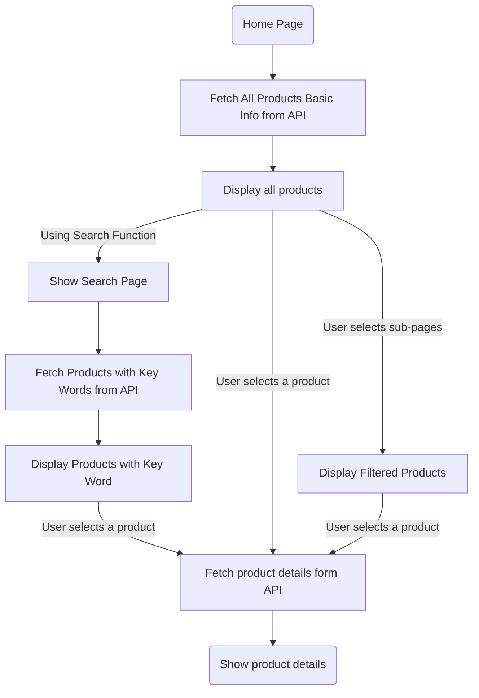

# Product Display Workflow

## Overview
The `ListCard` component fetches product data from the `/data` API and displays it based on the selected category (`type`). This document outlines the structure of the data and how the frontend manages product categorization and presentation.

## Data Format
Each product from the API contains the following fields:

- **serialNumber**: A unique identifier for the product.
- **productName**: The product's name, including specific model details.
- **brand**: The brand of the product.
- **model**: The product's specific model identifier.
- **description**: A brief description of the product’s key features and specifications.
- **price**: The price in USD.
- **image**: URL of the product image.
- **clicks**: The number of user clicks or views, indicating popularity.
- **type**: **_TODO: Need Fix_** The product's category, such as "phone" or "PC".

## Workflow Overview

1. **Data Fetching**:  
   The `ListCard` component makes a request to `/data` to fetch all product data.
   
2. **Category Filtering**:  
   Based on the user’s selected page, the `type` field is used to filter products for display. For example:
   - If the user selects the “smartphone” category, only products with `type: phone` are displayed.

3. **Rendering**:  
   Products matching the selected `type` are displayed as cards, with the following info: name, brand, model, description, price, clicks, and an image.

### Diagram for Display Pages

