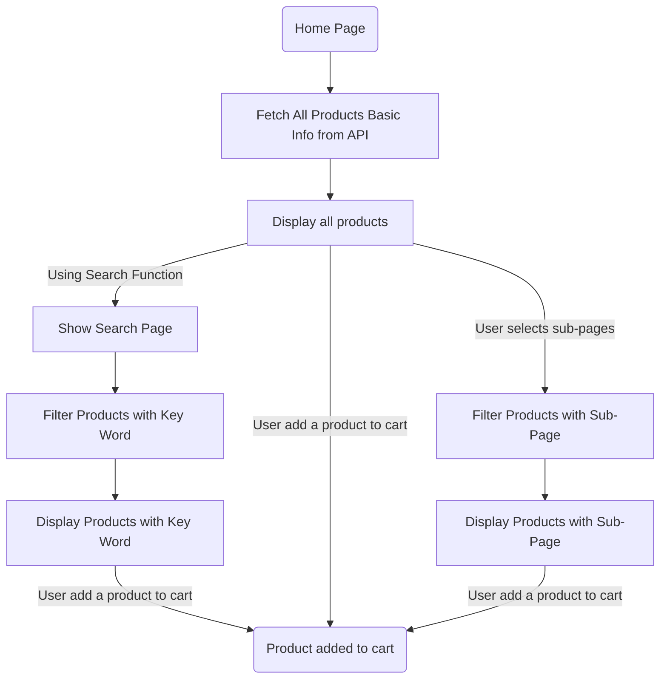
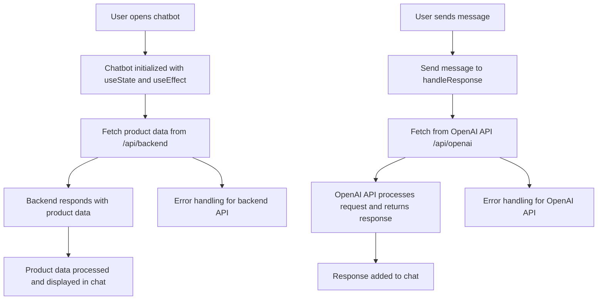

> **Warning❗️:** This project is now totally hugging with yarn, so please use yarn to install the dependencies and run the project.
>> yarn install
>
>> yarn dev
>
>> yarn build

# Application Integration
**Members : Ao XIE, Reynalde SEGERIE, Antoine Viton**

# Context of use
Nous sommes l'équipe de développement d'une jeune entreprise de multimédia dénommé KASA souhaitant automatiser la gestion de son catalogue de produits. L'entreprise KASA besoin d'une application web pour afficher les produits, les trier par catégorie et permettre aux utilisateurs de rechercher des produits.
Par ailleurs, l'entreprise souhaite se démarquer de ses concurrents en proposant une expérience utilisateur de qualité.

Afin de fidéliser sa clientèle, l'entreprise souhaite également mettre en place un système d'espace personnel (authentification, compte utilisateur, etc.) pour permettre aux utilisateurs de sauvegarder leurs produits préférés et de retrouver leurs recherches précédentes.

We are the development team of a young multimedia company called KASA that wants to automate the management of its product catalogue. KASA needed a web application to display products, sort them by category and allow users to search for products.
The company also wanted to stand out from its competitors by offering a high-quality user experience.

In order to build customer loyalty, the company also wanted to set up a personal space system (authentication, user account, etc.) to enable users to save their favourite products and retrieve their previous searches.

# Product Display Workflow
<font color='red'>**TODO:** The code in the Getting Data from API section has been refactored and needs to be rewritten except for the flowchart.</font>


## Overview
The `ListCard` component fetches product data from the `/data` API and displays it based on the selected category (`type`). This document outlines the structure of the data and how the frontend manages product categorization and presentation.

## Data Format
Each product from the API contains the following fields:

- **serialNumber**: A unique identifier for the product.
- **productName**: The product's name, including specific model details.
- **brand**: The brand of the product.
- **model**: The product's specific model identifier.
- **description**: A brief description of the product’s key features and specifications.
- **price**: The price in USD.
- **image**: URL of the product image.
- **clicks**: The number of user clicks or views, indicating popularity.
- **type**: <font color='red'>**_TODO: Need Fix_**</font> The product's category, such as "phone" or "PC".

## Workflow Overview

1. **Data Fetching**:  
   The `ListCard` component makes a request to `/data` to fetch all product data.
   
2. **Category Filtering**:  
   Based on the user’s selected page, the `type` field is used to filter products for display. For example:
   - If the user selects the “smartphone” category, only products with `type: phone` are displayed.

3. **Rendering**:  
   Products matching the selected `type` are displayed as cards, with the following info: name, brand, model, description, price, clicks, and an image.

### Diagram for Display Pages



# Chatbot Workflow

## Overview
The chatbot is a conversational interface that helps users find products based on their preferences. This document outlines the chatbot's structure and how it interacts with the product data.

## ChatGPT API 
Component of the __ChatBot__ has been implemented using the OpenAI ChatGPT API.  <font color='red'>**_This API need a key which was stocked in the `.env.local` file._**</font> So this file is not included in the repository. Utilize the following format to create the file:
```json
OPENAI_API_KEY=your_key_here
```

## Workflow Overview


# Search Functionality

## Overview

by using Fuse.js, the search functionality allows users to search for products based on keywords. This document outlines the search functionality and how it interacts with the product data.

