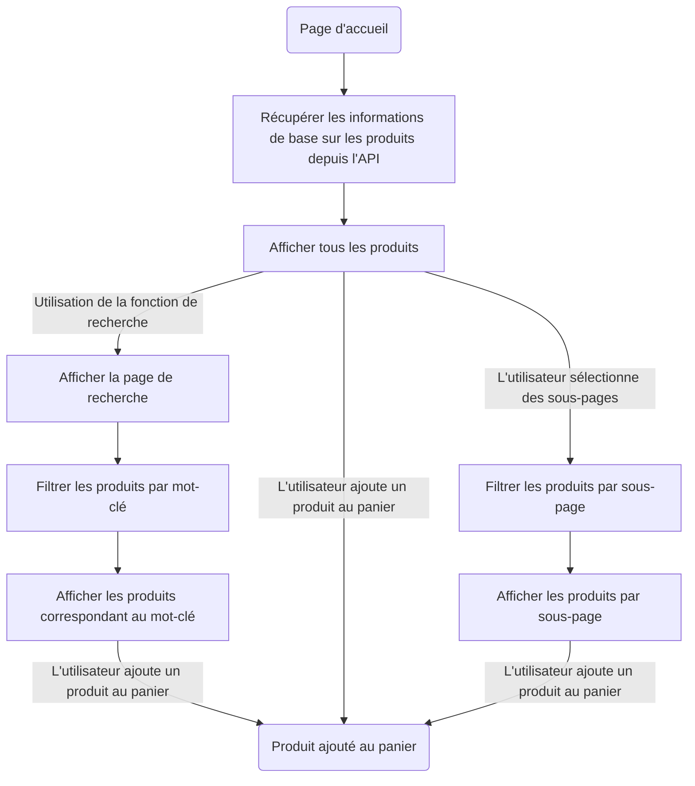
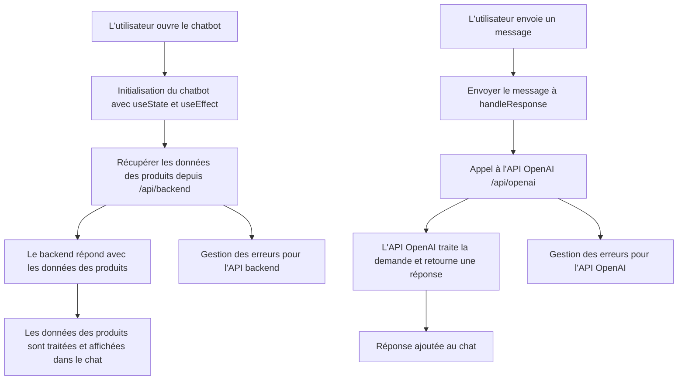
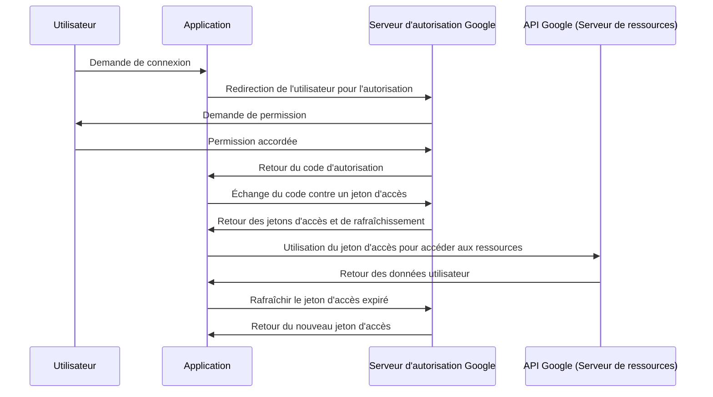
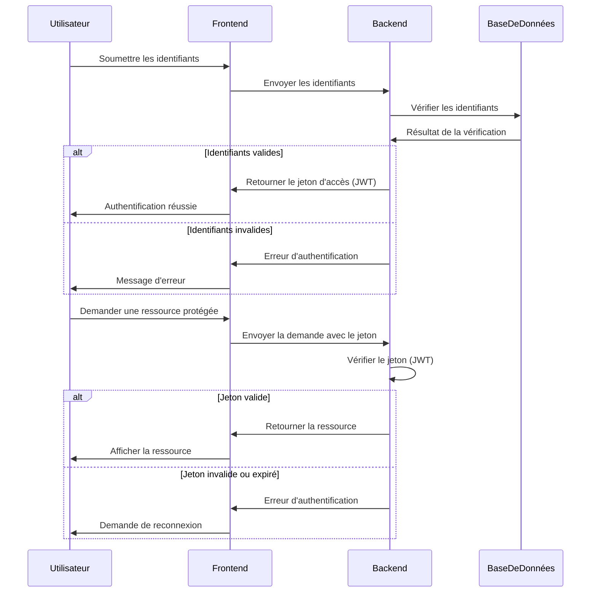

[](../README.md)
[](/README/README_fr_FR.md)

> **Attention❗️ :** Ce projet utilise uniquement yarn, veuillez donc utiliser yarn pour installer les dépendances et exécuter le projet.
>> yarn install
>
>> yarn dev
>
>> yarn build

# Intégration de l'application
**Membres : Ao XIE, Reynalde SEGERIE, Antoine Viton**

# Contexte d'utilisation
Nous sommes l'équipe de développement d'une jeune entreprise de multimédia nommée KASA qui souhaite automatiser la gestion de son catalogue de produits. L'entreprise KASA a besoin d'une application web pour afficher les produits, les trier par catégorie et permettre aux utilisateurs de rechercher des produits.
De plus, l'entreprise souhaite se démarquer de ses concurrents en offrant une expérience utilisateur de qualité.

Afin de fidéliser sa clientèle, l'entreprise souhaite également mettre en place un système d'espace personnel (authentification, compte utilisateur, etc.) permettant aux utilisateurs de sauvegarder leurs produits favoris et de retrouver leurs recherches précédentes.

# Flux de présentation des produits
<font color='red'>**TODO :** Le code de la section "Récupération des données depuis l'API" a été refactorisé et doit être réécrit à l'exception du diagramme de flux.</font>

## Vue d'ensemble
Le composant `ListCard` récupère les données des produits depuis l'API `/data` et les affiche en fonction de la catégorie sélectionnée (`type`). Ce document décrit la structure des données et la manière dont le frontend gère la catégorisation et la présentation des produits.

## Format des données
Chaque produit de l'API contient les champs suivants :

- **serialNumber** : Un identifiant unique pour le produit.
- **productName** : Le nom du produit, y compris les détails spécifiques du modèle.
- **brand** : La marque du produit.
- **model** : L'identifiant spécifique du modèle.
- **description** : Une brève description des caractéristiques et spécifications principales du produit.
- **price** : Le prix en USD.
- **image** : URL de l'image du produit.
- **clicks** : Le nombre de clics ou de vues, indiquant la popularité.
- **type** : <font color='red'>**_TODO : À corriger_**</font> La catégorie du produit, comme "téléphone" ou "PC".

## Vue d'ensemble du flux

1. **Récupération des données** :
   Le composant `ListCard` effectue une requête vers `/data` pour récupérer toutes les données des produits.

2. **Filtrage par catégorie** :
   En fonction de la page sélectionnée par l'utilisateur, le champ `type` est utilisé pour filtrer les produits à afficher. Par exemple :
   - Si l'utilisateur sélectionne la catégorie "smartphone", seuls les produits avec `type: phone` sont affichés.

3. **Rendu** :
   Les produits correspondant au `type` sélectionné sont affichés sous forme de cartes, contenant les informations suivantes : nom, marque, modèle, description, prix, clics, et image.

### Diagramme pour les pages d'affichage



# Flux de travail du chatbot

## Vue d'ensemble
Le chatbot est une interface conversationnelle qui aide les utilisateurs à trouver des produits en fonction de leurs préférences. Ce document décrit la structure du chatbot et son interaction avec les données des produits.

## API ChatGPT
Le composant du __ChatBot__ a été implémenté en utilisant l'API OpenAI ChatGPT. <font color='red'>**_Cette API nécessite une clé stockée dans le fichier `.env.local`._**</font> Ce fichier n'est pas inclus dans le dépôt. Utilisez le format suivant pour créer le fichier :
```json
OPENAI_API_KEY=votre_clé_ici
```

## Vue d'ensemble du flux


# Fonction de recherche

## Vue d'ensemble
En utilisant Fuse.js, la fonction de recherche permet aux utilisateurs de rechercher des produits par mots-clés. Ce document décrit la fonctionnalité de recherche et son interaction avec les données des produits.

# Intégration OAuth2 de Google


# Flux de connexion utilisateur

